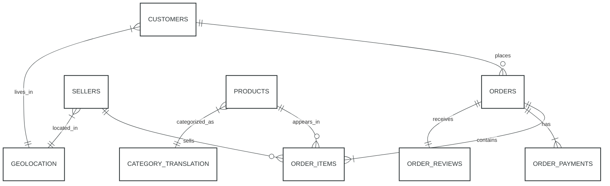

# Olist E-commerce Data Model

## Entity Relationship Diagram (ERD)

### Visual Reference

## Database Schema

### Tables

1. **CUSTOMERS**
   - customer_id (PK)
   - customer_unique_id
   - customer_zip_code_prefix
   - customer_city
   - customer_state

2. **ORDERS**
   - order_id (PK)
   - customer_id (FK)
   - order_status
   - order_purchase_timestamp
   - order_approved_at
   - order_delivered_carrier_date
   - order_delivered_customer_date
   - order_estimated_delivery_date

3. **ORDER_ITEMS**
   - order_id (FK)
   - order_item_id
   - product_id (FK)
   - seller_id (FK)
   - shipping_limit_date
   - price
   - freight_value

4. **ORDER_PAYMENTS**
   - order_id (FK)
   - payment_sequential
   - payment_type
   - payment_installments
   - payment_value

5. **ORDER_REVIEWS**
   - review_id (PK)
   - order_id (FK)
   - review_score
   - review_comment_title
   - review_comment_message
   - review_creation_date
   - review_answer_timestamp

6. **PRODUCTS**
   - product_id (PK)
   - product_category_name (FK)
   - product_name_length
   - product_description_length
   - product_photos_qty
   - product_weight_g
   - product_length_cm
   - product_height_cm
   - product_width_cm

7. **SELLERS**
   - seller_id (PK)
   - seller_zip_code_prefix
   - seller_city
   - seller_state

8. **GEOLOCATION**
   - geolocation_zip_code_prefix
   - geolocation_lat
   - geolocation_lng
   - geolocation_city
   - geolocation_state

9. **CATEGORY_TRANSLATION**
   - product_category_name (PK)
   - product_category_name_english

## Key Relationships

1. **Customers** can place multiple **Orders** (1:N)
2. Each **Order** contains multiple **Order Items** (1:N)
3. Each **Order** can have multiple **Payments** (1:N)
4. Each **Order** receives one **Review** (1:1)
5. **Sellers** can sell multiple **Order Items** (1:N)
6. **Products** can appear in multiple **Order Items** (1:N)
7. **Customers** and **Sellers** are linked to **Geolocation** via ZIP code prefix
8. **Products** are linked to **Category Translation** for English category names

## How to Use This ERD

### Viewing Options
1. **GitHub**: The Mermaid diagram renders automatically in GitHub's markdown viewer
2. **Interactive Editor**: 
   - Copy the Mermaid code
   - Paste into [Mermaid Live Editor](https://mermaid.live/)
   - Export as PNG/SVG/PDF
3. **Kaggle Reference**: 
   - Original schema: [Olist Dataset Schema on Kaggle](https://www.kaggle.com/datasets/olistbr/brazilian-ecommerce)
   - Includes additional context and field descriptions

### ERD Best Practices
- Use dbdiagram.io for interactive editing and collaboration
- Use Mermaid for version-controlled documentation
- Include both entity relationships and attribute details
- Document cardinality and optionality clearly

## Key Relationships

1. **Customers** can place multiple **Orders** (1:N)
2. Each **Order** contains multiple **Order Items** (1:N)
3. Each **Order** can have multiple **Payments** (1:N)
4. Each **Order** receives one **Review** (1:1)
5. **Sellers** can sell multiple **Order Items** (1:N)
6. **Products** can appear in multiple **Order Items** (1:N)
7. **Customers** and **Sellers** are linked to **Geolocation** via ZIP code prefix
8. **Products** are linked to **Category Translation** for English category names
