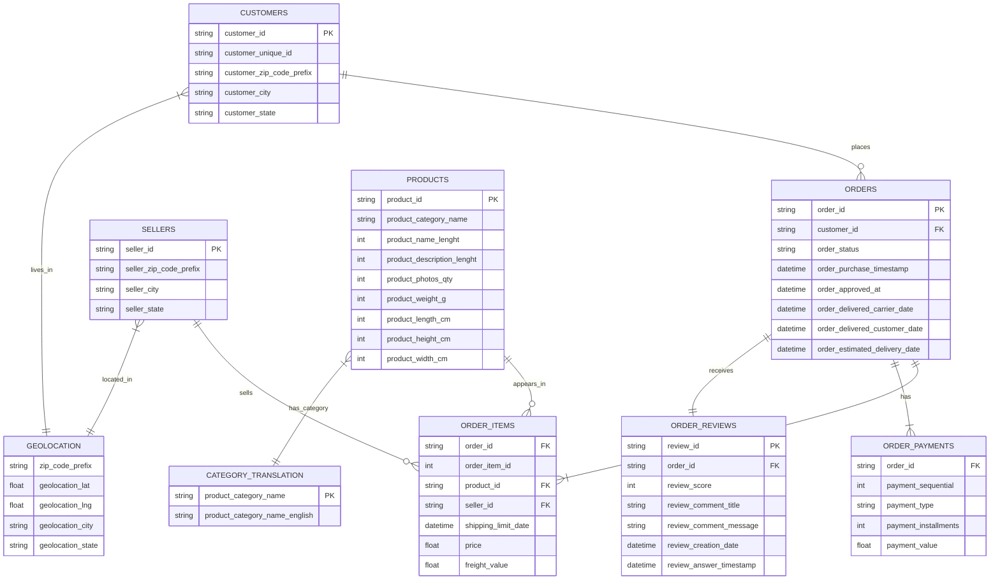

# Olist E-commerce Data Model

## Visual ERD Reference

### Option 1: dbdiagram.io
We've created an interactive ERD using dbdiagram.io for better visualization:

```
Table customers {
  customer_id varchar [primary key]
  customer_unique_id varchar
  customer_zip_code_prefix varchar
  customer_city varchar
  customer_state varchar
}

Table orders {
  order_id varchar [primary key]
  customer_id varchar [ref: > customers.customer_id]
  order_status varchar
  order_purchase_timestamp timestamp
  order_approved_at timestamp
  order_delivered_carrier_date timestamp
  order_delivered_customer_date timestamp
  order_estimated_delivery_date timestamp
}

# ... (other table definitions)
```

### Option 2: Mermaid.js (GitHub Compatible)


## How to Use This ERD

### Viewing Options
1. **GitHub**: The Mermaid diagram renders automatically in GitHub's markdown viewer
2. **Interactive Editor**: 
   - Copy the Mermaid code
   - Paste into [Mermaid Live Editor](https://mermaid.live/)
   - Export as PNG/SVG/PDF
3. **Kaggle Reference**: 
   - Original schema: [Olist Dataset Schema on Kaggle](https://www.kaggle.com/datasets/olistbr/brazilian-ecommerce)
   - Includes additional context and field descriptions

### ERD Best Practices
- Use dbdiagram.io for interactive editing and collaboration
- Use Mermaid for version-controlled documentation
- Include both entity relationships and attribute details
- Document cardinality and optionality clearly

## Key Relationships

1. **Customers** can place multiple **Orders** (1:N)
2. Each **Order** contains multiple **Order Items** (1:N)
3. Each **Order** can have multiple **Payments** (1:N)
4. Each **Order** receives one **Review** (1:1)
5. **Sellers** can sell multiple **Order Items** (1:N)
6. **Products** can appear in multiple **Order Items** (1:N)
7. **Customers** and **Sellers** are linked to **Geolocation** via ZIP code prefix
8. **Products** are linked to **Category Translation** for English category names
